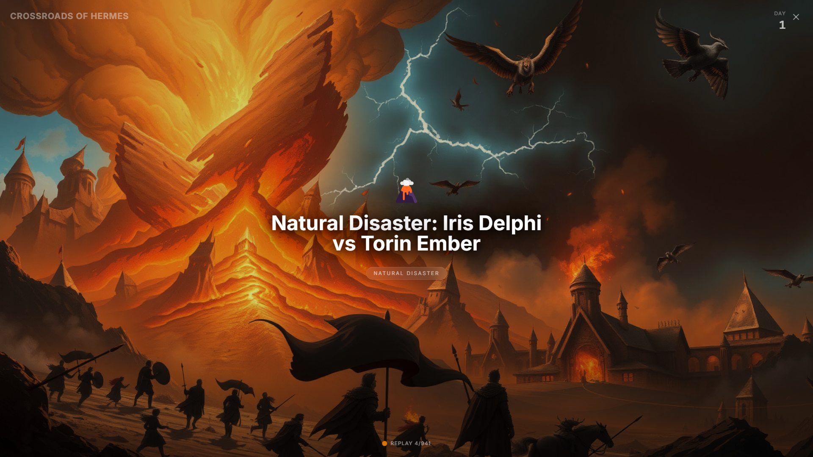
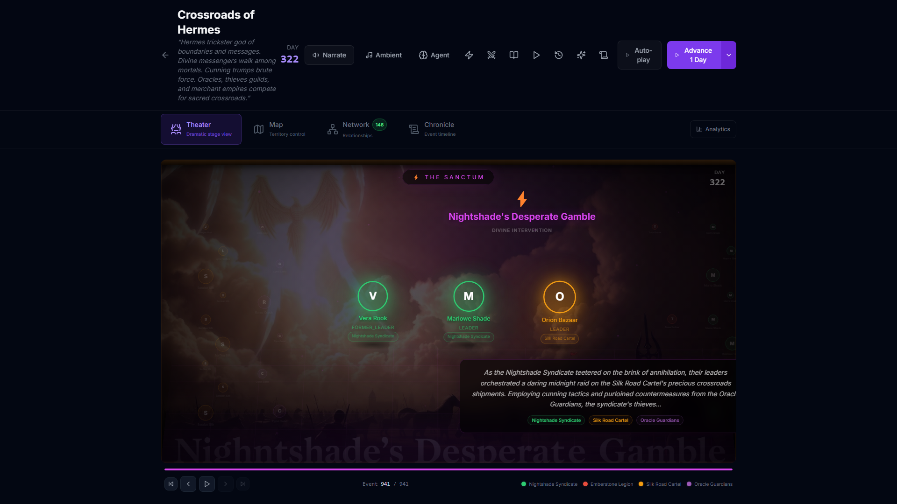
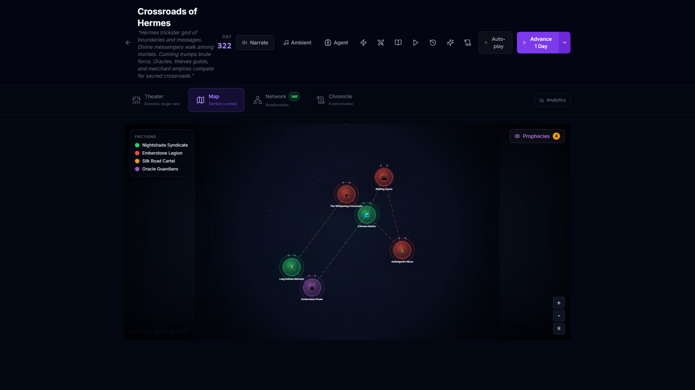
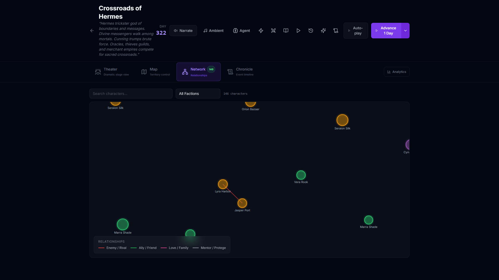
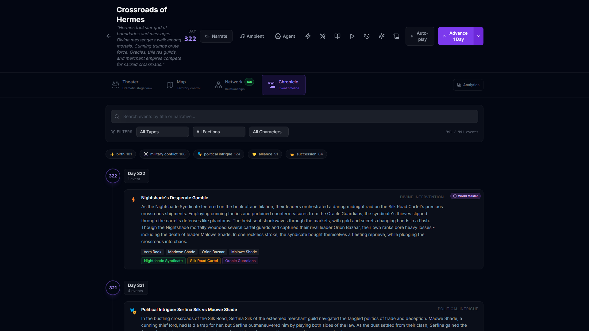

# HERMES GENESIS

**Describe a world. Watch it live. Watch it die.**

An autonomous living world engine powered by **Hermes-4-70B**. Type one sentence — the AI builds a complete civilization with regions, factions, characters carrying DNA, and ancient prophecies. Then the world runs itself. No scripting. No prompting. The world just... lives.

<p align="center">
  
  <br>
  <em>Cinematic Mode — fullscreen AI-generated scenes with procedural ambient sound and voice narration</em>
</p>

> **[Try the Live Demo](http://75.119.153.252:8003)** | **[Watch the Demo Video](#demo-video)**

---

## At a Glance

- Type one sentence &rarr; AI builds a living world with geography, factions, characters, prophecies
- Theater Mode &mdash; events play out on a dramatic stage with AI-generated scene images
- Cinematic Mode &mdash; fullscreen immersive experience with ambient sound and voice narration
- Genetic evolution &mdash; characters pass DNA to children, populations shift over generations
- Autonomous World Master &mdash; an AI agent observes, reasons, intervenes, and chases prophecies on its own

<table>
  <tr>
    <td width="50%">
      
      <br>
      <b>Theater Mode</b> — Dramatic stage with character sprites, AI scene images, faction positioning
    </td>
    <td width="50%">
      
      <br>
      <b>World Map</b> — SVG regions, faction territories, prophecy tracking
    </td>
  </tr>
  <tr>
    <td width="50%">
      
      <br>
      <b>Relationship Graph</b> — D3 force-directed network across 146 characters
    </td>
    <td width="50%">
      
      <br>
      <b>Chronicle</b> — 941 events across 322 days of autonomous history
    </td>
  </tr>
</table>

---

## What Makes This Different

| AI Dungeon / NovelAI | ChatGPT D&D Assistants | Dwarf Fortress | **Hermes Genesis** |
|---|---|---|---|
| Generates text on demand | Helps DMs generate content | Procedural world generation | **Autonomous simulation that lives without prompts** |
| No persistent world state | No memory between sessions | No AI-driven narrative | **Characters remember, factions evolve, events chain** |
| Requires constant prompting | Reactive only | Rule-based | **AI World Master acts on its own agenda** |
| No genetic evolution | No evolution | Trait-based | **6-trait DNA with crossover, mutation, natural selection** |

---

## Why Hermes-4-70B?

This project exists because of capabilities unique to Hermes:

1. **Uncensored Creative Reasoning** — The World Master makes brutal decisions: kill characters, trigger disasters, betray alliances. Hermes-4-70B maintains narrative logic without safety refusals that would break immersion.

2. **Multi-Persona System Adherence** — Hundreds of characters with distinct personalities shaped by their genome (courage, cunning, loyalty, ambition, empathy, resilience). Hermes maintains character consistency across all interactions — chat, council debates, and event narration.

3. **Structured Reasoning Over Complex State** — The World Master observes hundreds of events, reasons about causality chains, faction power dynamics, and character fitness scores, then makes strategic interventions. Hermes excels at reasoning over structured JSON world state where other models hallucinate or lose context.

4. **Long-Context Planning** — Prophecy fulfillment requires tracking conditions across hundreds of simulated days. The World Master autonomously identifies when world state satisfies prophecy conditions and triggers fulfillment events — true long-term planning without human guidance.

5. **Reliable JSON Generation** — Every LLM call returns structured JSON (events, characters, factions, interventions). Hermes-4-70B produces valid structured output consistently, which is critical for a simulation engine that parses every response programmatically.

---

## Demo Video

<!-- Replace with your actual video link -->
<!-- [](https://youtu.be/YOUR_VIDEO_ID) -->

*Video coming soon — world generation, map exploration, simulation, cinematic mode, character chat, and chronicle export in 3 minutes.*

---

## How It Works

1. **You describe it** — "Norse mythology where Ragnarok approaches" or "cyberpunk megacity with corporate warfare"
2. **It builds itself** — geography, factions with ideologies, characters with genetic traits, and 4 cryptic prophecies
3. **It comes alive** — every day: battles, political intrigue, betrayals, alliances, discoveries, births, deaths
4. **Events cause events** — a betrayal triggers a war, which causes a succession crisis, which leads to an alliance
5. **An AI agent governs** — the World Master watches, reasons about narrative arcs, and intervenes when the story needs it
6. **Characters evolve** — offspring inherit traits via crossover + mutation. Over generations, natural selection reshapes the population

---

## Features

| Category | What You Get |
|---|---|
| **Core Simulation** | World generation from natural language, genome-based character evolution, 13 event types, causality chains, prophecy tracking + fulfillment |
| **Autonomous Agent** | World Master AI with observe-reason-act loop, narrative arc planning, autonomous intervention, prophecy chasing ([source](backend/services/agent.py)) |
| **Theater Mode** | Dramatic stage with curtains, spotlights, character sprites, faction-aware positioning, speech bubbles, AI scene images, auto-play scrubber |
| **Cinematic Mode** | Fullscreen world map overlay, live auto-simulation, history replay/documentary mode, event title cards with Ken Burns zoom |
| **Audio** | Procedural ambient sound via Web Audio API — 13 mood profiles with oscillators, noise layers, LFO tremolo, crossfade transitions ([source](frontend/src/hooks/useAmbientSound.ts)); voice narration via Web Speech API |
| **Interactive** | SVG world map with event markers, God Mode intervention, character chat, faction council debates |
| **Analytics** | Faction power timeline (Recharts), genome evolution chart, D3 force-directed relationship graph |
| **Export** | Chronicle (epic narrative), Campaign Kit (TTRPG module), Session Prep (GM plan) |
| **Integration** | Telegram bot, SSE streaming, autonomous agent with start/stop/status/logs API |

---

## The Genome System

Every character carries 6 genetic traits: **courage, cunning, loyalty, ambition, empathy, resilience** (each 0.0–1.0).

- Traits drive events: high courage wins battles, high cunning wins intrigue, low loyalty enables betrayal
- Children inherit traits via crossover (50% from each parent) + 10% mutation chance
- Low-fitness characters die off — natural selection reshapes the population over generations
- After 100+ days, you can see the population evolve: worlds that reward cunning breed cunning people

Source: [`backend/services/simulation.py`](backend/services/simulation.py)

---

## Who This Is For

**Writers** — Generate complex storylines with cause-and-effect. Export as markdown novels. Character arcs that evolve naturally.

**Game Designers** — Procedural narrative systems. Genetic evolution mechanics. Faction dynamics simulation.

**TTRPG Players** — Auto-generate D&D campaigns. Living NPCs with memory. Session prep in 1 click.

**AI Researchers** — Multi-agent coordination. Emergent narrative behavior. Genetic algorithms in creative systems.

---

## Quick Start

```bash
# Fastest: Docker (recommended)
git clone https://github.com/Ridwannurudeen/hermes-genesis
cd hermes-genesis
cp .env.example .env    # add your NOUS_API_KEY
docker compose up -d    # http://localhost:8003
```

Or try the **[live demo](http://75.119.153.252:8003)** — no setup required.

<details>
<summary>Manual setup (without Docker)</summary>

```bash
# Backend
cd backend
python -m venv .venv && source .venv/bin/activate
pip install -r requirements.txt
cp .env.example .env    # add your NOUS_API_KEY
uvicorn main:app --reload --port 8003

# Frontend (new terminal)
cd frontend
npm install && npm run dev
```

</details>

| Variable | Required | Description |
|---|---|---|
| `NOUS_API_KEY` | Yes | NousResearch inference API key |
| `TELEGRAM_BOT_TOKEN` | No | For Telegram bot integration |
| `PORT` | No | Defaults to `8003` |

---

## How Hermes-4-70B Powers Each Component

| Component | What Hermes Does |
|---|---|
| **World Generation** | Creates geography, factions, characters, and prophecies from one sentence |
| **Event Simulation** | Generates events weighted by character genomes, faction dynamics, and causality chains |
| **Event Narration** | Writes vivid prose for each event based on character traits and world state |
| **World Master Agent** | Observes, reasons, decides to simulate, intervene, or focus — then sees consequences |
| **Divine Intervention** | Interprets natural language commands ("destroy the capital") and applies structured effects |
| **Character Chat** | Responds in-character shaped by genome, faction loyalty, and personal history |
| **Faction Council** | Each leader argues their position based on current power dynamics and relationships |
| **Prophecy Fulfillment** | Detects when world events match prophecy conditions, marks them fulfilled |
| **Chronicle / Campaign** | Writes publishable narrative histories and TTRPG campaign modules from world state |

---

## Architecture

```
         Hermes-4-70B (NousResearch API)
                    |
     +--------------v--------------+
     |     FastAPI Backend         |        29 API endpoints
     |     Python 3.11             |        SSE streaming
     |                             |        71 tests
     |  World Generation           |
     |  Simulation Engine          |        backend/services/simulation.py
     |  Autonomous Agent           |        backend/services/agent.py
     |  Genetic Evolution          |        backend/services/simulation.py
     |  Prophecy Checker           |        backend/services/prophecy.py
     |  Telegram Bot               |        backend/services/telegram.py
     +--------------+--------------+
                    |
     +--------------v--------------+
     |     React 18 Frontend       |        29 code-split chunks
     |     TypeScript + Tailwind   |        Framer Motion animations
     |                             |
     |  Theater Mode (Stage View)  |        components/TheaterMode.tsx
     |  Cinematic Mode (Fullscreen)|        components/CinematicMode.tsx
     |  Procedural Ambient Sound   |        hooks/useAmbientSound.ts
     |  Voice Narration            |        hooks/useVoiceNarration.ts
     |  Cinematic World Map (SVG)  |        components/WorldMap.tsx
     |  D3 Relationship Graph      |        components/RelationshipGraph.tsx
     |  God Mode / Chronicle       |        pages/WorldView.tsx
     +-----------------------------+
```

---

## Tech Stack


[**71 tests**](backend/tests/) | **29 code-split chunks** | [**29 API endpoints**](backend/routes/) | **Deployed on VPS**

---

## Roadmap

**v1.0 (Hackathon)** — Core simulation, Theater Mode, Cinematic Mode, ambient sound, voice narration, autonomous World Master, genetic evolution, God Mode, character chat, faction council, chronicle export, campaign kit, session prep, Telegram bot

**v1.1** — Multiplayer worlds (shared persistence), voice-to-world (speak your world into existence), mobile-responsive UI

**v2.0** — Community world sharing marketplace, genetic drift analysis tools, AI dungeon master mode for live TTRPG sessions

---

## Built for the NousResearch Hermes Agent Hackathon

Hermes Genesis demonstrates what happens when you give Hermes-4-70B full creative control over a living world. Every character decision, every faction power shift, every prophecy fulfilled — all driven by Hermes reasoning over structured world state.

The world doesn't wait for you. It lives on its own.

---

MIT License
