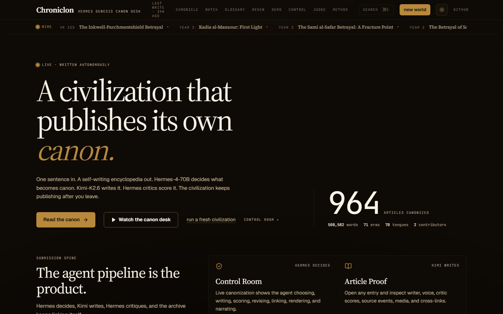
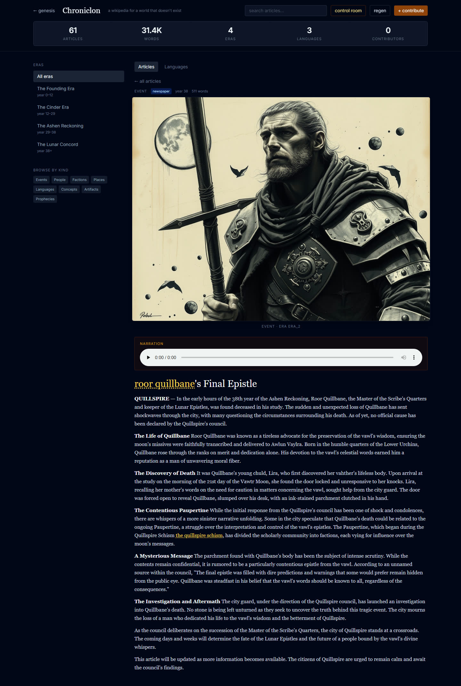
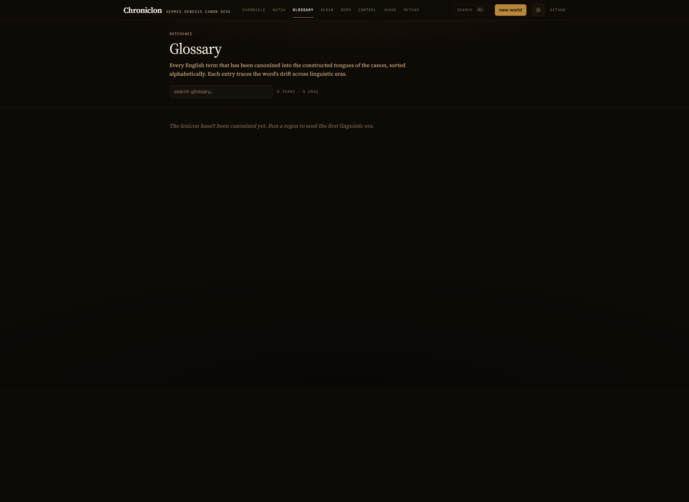
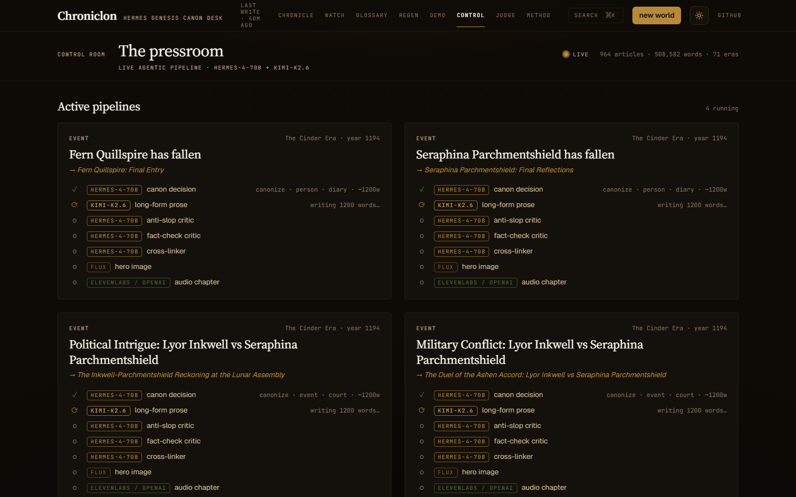
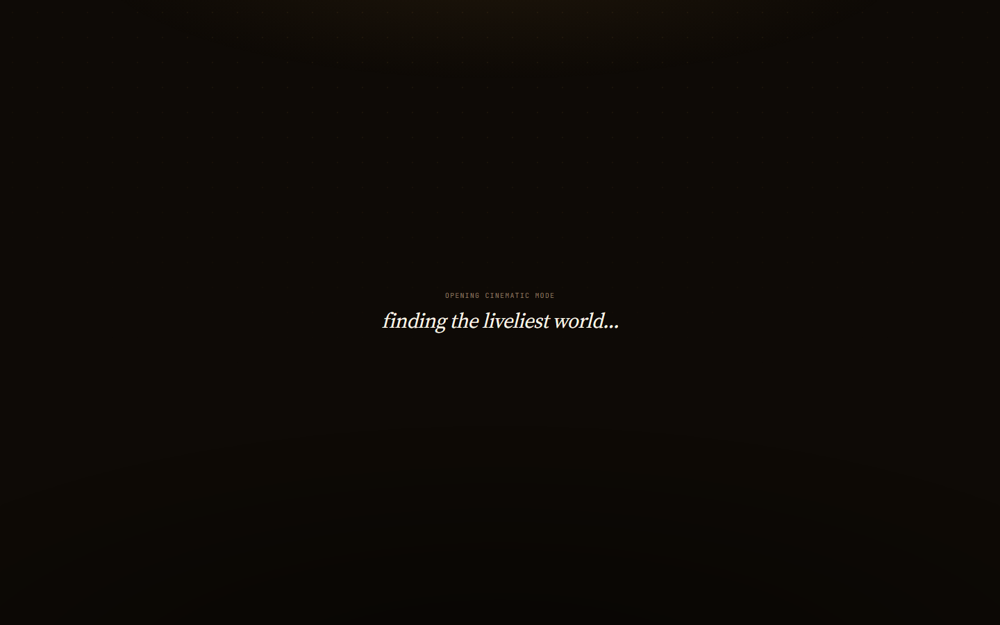

<div align="center">

# Hermes Genesis

### A wikipedia for a world that doesn't exist

An autonomous fiction engine. One sentence in, a self-writing canon out — three AI agents publish a fictional Wikipedia, illustrate it, narrate it, and let the language drift across centuries. The civilization keeps publishing whether anyone's watching.

[](https://hermesgenesis.world)
[](https://github.com/NousResearch)
[](https://moonshot.ai)
[](https://blackforestlabs.ai)
[](https://elevenlabs.io)
[](LICENSE)

[**Live →**](https://hermesgenesis.world) ·
[**Watch →**](https://hermesgenesis.world/watch) ·
[**Glossary →**](https://hermesgenesis.world/glossary) ·
[**Demo film (75 s)**](docs/X_THREAD.md) ·
[**AI usage**](AI_USAGE.md) ·
[**Paper outline**](docs/PAPER_OUTLINE.md)

</div>

<p align="center">
  
  <br>
  <em>Editorial front door — Source Serif 4 + JetBrains Mono on warm paper, magazine-style featured article, live article counter that flashes when the canon publishes.</em>
</p>

---

## What it does

- **Autonomous publishing pipeline.** Three Hermes-4-70B agents and one Kimi-K2.6 long-form writer collaborate to canonize, draft, score, and revise articles about a simulated civilization. Pass → seal. Fail → revise. Skip-rate ~40% — the canon agent says *no* a lot.
- **Real linguistic drift.** Each in-world era has its own phonological rules and lexicon. `karim` (Lunar) → `cherim` (Cinder) → `cherim-en` (Ash) tracks a /k/ → /tʃ/ palatalization across centuries. Sample texts and inscriptions in every era's tongue.
- **Multimedia by default.** FLUX-illustrated articles, ElevenLabs voice narration with character-genome-mapped archetypes, mood-themed cinematic playback per event type.
- **Provenance everywhere.** Every published article traces back to the simulation event that birthed it. Critic scores (anti-slop, fact-check) on every page. Cross-linked canon. RSS, OG cards, sitemap.
- **Hermes Agent native.** 9 repo-local skills + MCP bridge (17 tools) plug directly into [hermes-agent](https://github.com/NousResearch/hermes-agent). One-command setup.

## Live

```
960 canonized articles · 4 in-world eras · 65 linguistic eras
~1 article published every 2 minutes · publishing right now
```

[hermesgenesis.world](https://hermesgenesis.world) · [/watch](https://hermesgenesis.world/watch) · [/glossary](https://hermesgenesis.world/glossary) · [/control](https://hermesgenesis.world/control) · [/judge](https://hermesgenesis.world/judge)

---

## How it works

```
  World simulation                                Hermes-4-70B
  ────────────────                                ────────────
  geography · factions · genomes      ┌────►  Canon agent (decision)
  day-by-day events                   │           │
  auto-simulation when queue empties  │           ▼ canonize?
                                      │       Kimi-K2.6 writes long-form
                                      │           │
                                      │           ▼
                                      │       Hermes critics
                                      │       anti-slop · fact-check
                                      │           │
                                      │           ▼ pass / revise
                                      │       Cross-linker
                                      │           │
                                      │           ▼
                                      └─── Sealed article + provenance
                                                  │
                                                  ▼
                                       FLUX illustration · ElevenLabs narration
```

**Three agents, two models.** [`backend/chroniclon/canon_agent.py`](backend/chroniclon/canon_agent.py) is the orchestrator.

| Stage | Role | Model |
|---|---|---|
| **Canon decision** | Reads each event, decides if it deserves an article, picks kind/voice/length | Hermes-4-70B |
| **Long-form writer** | Writes 1,000–1,500 words in the era's voice with cross-links | Kimi-K2.6 |
| **Anti-slop critic** | Rejects formulaic prose, fourth-wall breaks, AI tells | Hermes-4-70B |
| **Fact-check critic** | Cross-references claims against the existing canon | Hermes-4-70B |
| **Cross-linker** | Inserts `[[wiki-style-links]]` to existing articles | Hermes-4-70B |
| **Era ticker + linguistic drift** | Closes eras, opens next, derives next-era phonology + lexicon | Hermes-4-70B |
| **Illustration** | Era-art-style + character-genome-grounded hero image per article | FLUX |
| **Narration** | Multi-archetype TTS per character genome (5 voices) | ElevenLabs |

**Quality gates** that keep the canon clean:

- Slug-collision guard at the write layer
- Topic dedupe (Jaccard ≥ 0.7) before canonization
- Publish floor: anti-slop ≥ 0.55 + fact-check ≥ 0.55 (after one revision attempt)
- Slug-dedup at the list endpoint

---

## See it

<p align="center">
  
</p>

<table align="center">
  <tr>
    <td width="50%" align="center">
      <a href="https://hermesgenesis.world/chronicle/the-inkwell-parchmentshield-betrayal-seraphinas-final-entry"></a><br>
      <b>Article</b> — drop cap, FLUX hero, ElevenLabs narration, critic scores
    </td>
    <td width="50%" align="center">
      <a href="https://hermesgenesis.world/glossary"></a><br>
      <b>Glossary</b> — alphabetized lexicon across in-world eras
    </td>
  </tr>
  <tr>
    <td width="50%" align="center">
      <a href="https://hermesgenesis.world/control"></a><br>
      <b>Control Room</b> — canon agent → writer → critics → illustrator → narrator, live
    </td>
    <td width="50%" align="center">
      <a href="https://hermesgenesis.world/watch"></a><br>
      <b>/watch</b> — full-screen mood-themed playback against the liveliest world
    </td>
  </tr>
</table>

---

## Quick start

```bash
git clone https://github.com/Ridwannurudeen/hermes-genesis
cd hermes-genesis
cp .env.example .env       # add NOUS_API_KEY (and optional KIMI / OPENAI / ELEVENLABS keys)
docker compose up -d       # http://localhost:8003
```

Or skip setup — the [live deployment](https://hermesgenesis.world) is the canonical artifact.

<details>
<summary>Manual setup (without Docker)</summary>

```bash
# Backend
cd backend
python -m venv .venv && source .venv/bin/activate
pip install -r requirements.txt
cp .env.example .env
uvicorn main:app --reload --port 8003

# Frontend
cd frontend
npm install && npm run dev
```

</details>

| Variable | Required | Notes |
|---|---|---|
| `NOUS_API_KEY` | Yes | Hermes-4-70B inference |
| `KIMI_API_KEY` | Recommended | Kimi-K2.6 for long-form writing (falls back to Nous if unset) |
| `IMAGE_API_KEY` | Optional | FLUX illustrations |
| `OPENAI_API_KEY` / `ELEVENLABS_API_KEY` | Optional | TTS narration |
| `TELEGRAM_BOT_TOKEN` | Optional | Telegram bot |

---

## Hermes Agent integration

Ships as **9 hermes-agent skills** + an **MCP bridge** with **17 tools** + a **one-command setup**:

```bash
./setup-hermes-agent.sh                                  # local
./setup-hermes-agent.sh https://hermesgenesis.world      # remote
```

| Skill | Purpose |
|---|---|
| [`world-master`](skills/world-master/SKILL.md) | Full observe→reason→act loop, governs a living world autonomously |
| [`chroniclon`](skills/chroniclon/SKILL.md) | The canon agent + critics + writer + linguistic drift |
| [`genesis-create`](skills/genesis-create/SKILL.md) | World generation from one sentence |
| [`genesis-chat`](skills/genesis-chat/SKILL.md) | In-character conversations shaped by genome |
| [`genesis-chronicle`](skills/genesis-chronicle/SKILL.md) | TTRPG campaign kits + narrative exports |
| [`mcp-server`](skills/mcp-server/SKILL.md) | hermes-agent ↔ Genesis MCP setup |
| + 3 more | See [`skills/`](skills/) |

MCP bridge auto-discovered by hermes-agent via stdio:

```
genesis_create_world      genesis_simulate         genesis_intervene
genesis_chat              genesis_council          genesis_chronicle
chronicle_stats           chronicle_list_articles  chronicle_get_article
chronicle_render_audio    chronicle_render_image   chronicle_control_backlog
… 5 more
```

Source: [`mcp-bridge/server.mjs`](mcp-bridge/server.mjs) · [`hermes-agent-demo.py`](hermes-agent-demo.py).

---

## Stack


**Backend** — FastAPI · 60+ endpoints · SSE streaming · file-locked atomic JSON store · 71 tests
**Frontend** — React 18 · Source Serif 4 + JetBrains Mono · strict editorial palette · D3 · Framer Motion · 16 tests (vitest)
**Infra** — Docker Compose (web + canon-runner) · nginx + certbot · GitHub Actions CI

---

## Demo film

A 75-second editorial demo accompanies the [X submission](docs/X_THREAD.md) — programmatic React composition (Remotion) rendered to mp4. ElevenLabs Antoni narration over a Kevin MacLeod (CC-BY-3.0) music bed; Seraphina narration takes the floor for 7 seconds during the proof beat. Video is the canonical artifact; source composition lives outside this repo.

---

## Why Hermes-4-70B

Two reasons the canon stack runs on Hermes specifically, not a hosted alternative:

1. **Uncensored creative reasoning.** The canon agent makes brutal calls — kills characters, ends dynasties, cancels prophecies. A safety-tuned model refuses these and the encyclopedia goes flat.
2. **Open-weight agentic tool-use.** The MCP bridge invokes Hermes as a tool-calling model. Hermes-4-70B holds its tool-call schema across long, stateful loops; we self-host it without depending on a closed API for the agent loop.

Kimi-K2.6 carries the long-form writing because of its 256 K context — the writer sees ~50 prior canon excerpts when drafting any article.

---

## Numbers from the live API

```
$ curl -s https://hermesgenesis.world/api/chronicle/stats
{
  "article_count":     960,
  "total_words":       1156842,
  "era_count":         4,
  "linguistic_eras":   65,
  "subscriber_count":  3,
  "last_canon_write":  "2026-05-01T11:42:08+00:00"
}
```

13 worlds running on the production VPS. The largest (Wellspring Kingdom) is on day 335. All events, all characters, all faction dynamics: autonomous. No scripting.

---

## What makes this different

|  | AI Dungeon | Stanford Smallville / AI Town | Hidden Door | **Hermes Genesis** |
|---|---|---|---|---|
| **Autonomy** | reactive only | simulation only | humans drive scenes | autonomous publishing |
| **Persistence** | none | session memory | per-game | full canon, indefinite |
| **Cross-temporal coherence** | none | none | per-session | cross-era cross-linked canon |
| **Linguistic depth** | none | none | none | phonological drift across eras |
| **Critic loop** | none | none | none | anti-slop + fact-check before publish |
| **Publishing artifact** | text fragment | none | scene transcript | encyclopedia |

The category as we frame it: *autonomous publishing of fictional canon with cross-temporal coherence and linguistic drift.* See [`docs/PAPER_OUTLINE.md`](docs/PAPER_OUTLINE.md) for the workshop-paper framing.

---

## Roadmap

| Stage | Status |
|---|---|
| Core simulation, autonomous canon, critic loop | ✅ Live |
| Multimedia (FLUX + ElevenLabs + cinematic mode) | ✅ Live |
| Linguistic drift module | ✅ Live |
| Hermes-agent skills + MCP bridge | ✅ Live |
| Editorial reskin + 8-route nav | ✅ Live |
| 75s programmatic demo film | ✅ Shipped |
| Workshop paper (NeurIPS Creative AI) | 🔧 Drafting |
| Multiplayer worlds (shared persistence) | 📋 Planned |
| Voice-to-world (speak your world into existence) | 📋 Planned |

---

## Built for the NousResearch Hermes Agent Hackathon

Hermes Genesis demonstrates what Hermes Agent can do when given full creative control over a living world. The World Master implements hermes-agent's observe→reason→act pattern, repo-local skills integrate with the framework, and the MCP bridge connects every layer of the simulation to hermes-agent's tool ecosystem.

---

## License

[MIT](LICENSE).

Demo-film music: *Inspired* by Kevin MacLeod ([incompetech.com](https://incompetech.com)) — Creative Commons Attribution 3.0.
